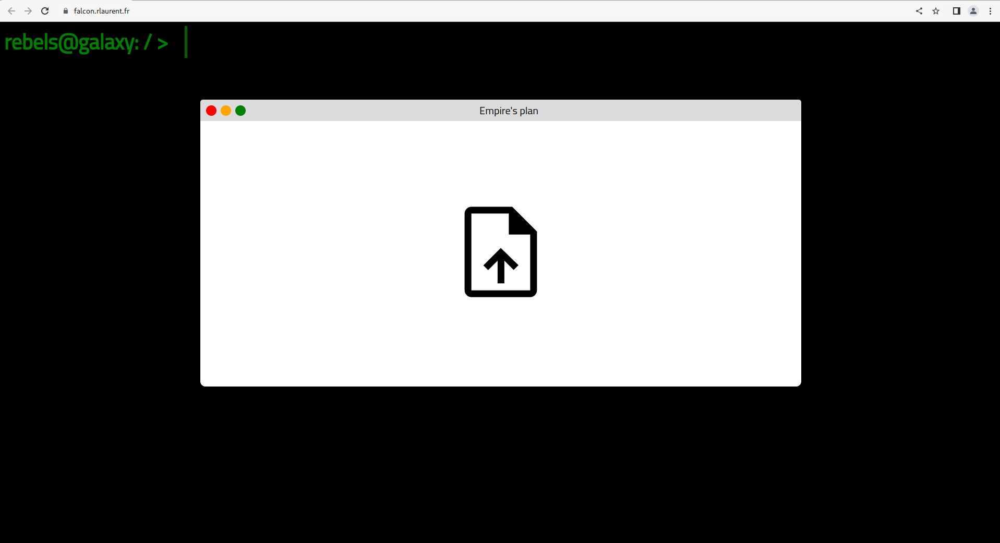
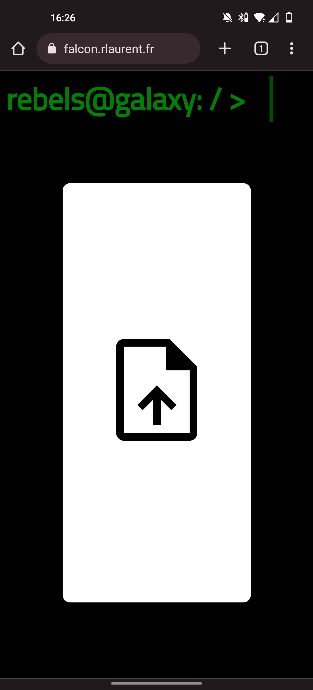
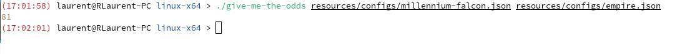
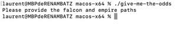
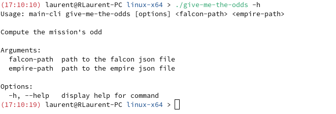
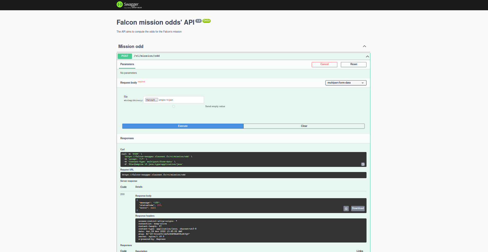
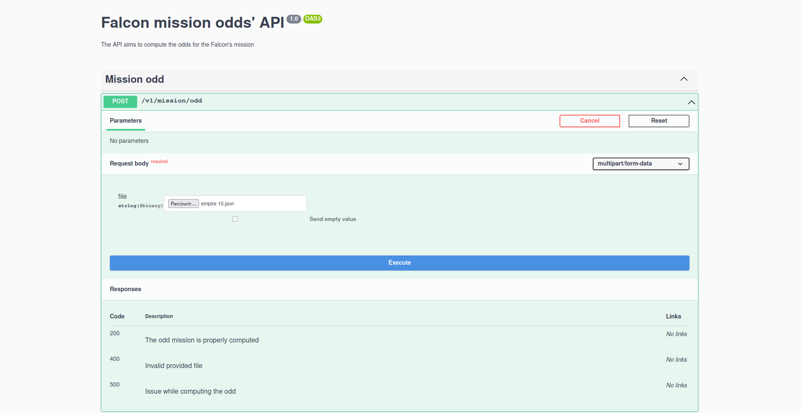

# The Millennium Falcon Challenge

## Context
The current project is a solution implementation in response of the Millennium Falcon Challenge.
The details of the mission are described [here](https://github.com/dataiku/millenium-falcon-challenge)

## What are the odds ?

Actually, there are several ways to get them. Let's discover that together!

### Requirements

To take up the challenge, the following stack has been chosen:
- Backend called the **Millennium Falcon** based on [NestJS](https://nestjs.com/)
- Frontend called **c3po** implemented in [Angular](https://angular.io/)
- Command line interface called **r2d2** using [Nest Commander](https://docs.nestjs.com/recipes/nest-commander#nest-commander)

If you would like to explore the project, you would need **at least** [Node LTS 18.12.1](https://nodejs.org/dist/v18.12.1/)
and  [NPM 8.19.2](https://www.npmjs.com/package/npm/v/8.19.2)

Eventually, you might need [Docker](https://www.docker.com/) with [Docker Compose](https://docs.docker.com/compose/).

### Web application
A first way to compute the odd is to use a developed web application which has been deployed: [falcon.rlaurent.fr](https://falcon.rlaurent.fr)

The UI consists in a basic window computer where you can upload the empire JSON file:

which is responsive:

### Command line interface
A second way to get the odds for a mission is to use the provided CLI, released in the project.

You can get the odds by launching the signed 'give-me-the-odds' executable.
You must select the executable base on your platform, which is reflected in the folder name of the CLI package delivered. The platforms available are:
- Windows x64
- Linux x64
- MacOS x64
- MacOS arm64

For instance the syntax on an [Archlinux distribution](https://archlinux.fr/) is :

``./give-me-the-odds <path to the millennium-falcon json file> <path to the empire json file>``

**_Note:_** The paths can be relative or absolute.

Example:

The CLI should guide you in your travel:

- No arguments provided: (launch on MacOS arm64)

- Too many arguments: (launch on Windows)

- Any time you can consult the help with:

``give-me-the-odds -h``

### Deploying locally on your computer

You can get the odds by running the web application on your computer. All you need is Docker and Docker Compose.

Once the project is released the [CI/CD pipeline](https://work.rlaurent.fr/login?from=%2F) pushes Docker images to [DockerHub](https://hub.docker.com/) :
- [Backend image](https://hub.docker.com/repository/docker/rlcdev/millennium-falcon)
- [Frontend image](https://hub.docker.com/repository/docker/rlcdev/millennium-falcon-front)

So you can use docker-compose to deploy it locally. From the root of the project:

``cd deployment && docker-compose up -d``

### Using Swagger

Eventually the last way to get the odds is to use [Swagger](https://swagger.io/).
Along with the deliveries a 'Swagger' of the API is deployed here: [falcon-swagger.rlaurent.fr/swagger](https://falcon-swagger.rlaurent.fr/swagger)

You can then upload you empire json file and get the odds.

An example:

It's not the main goal of Swagger, of course! :)

However, you can discover the exposed API: Falcon mission odds' API :

# Contribution

Supposing you are matching the requirements.
If you would like to contribute to the project. You would need first to (supposing you can access to the repository) git clone the project: 

`` git clone git@github.com:rlcDev/millennium-falcon-challenge.git``

### The backend

- To start the backend, you should run (from the project root):

``cd millenium-falcon && npm start``

And you can target the api on port 3000.

**_Note:_** Swagger will be available at [http://localhost:3000/swagger](http://localhost:3000/swagger)

- To run the unit tests : 

``cd millenium-falcon && npm run test``

- To run the e2e test :

``cd millenium-falcon && npm run test:e2e``

- To check the test coverage

``cd millenium-falcon && npm run test:cov``

Also, there is a script to generate the cli:

``cd millenium-falcon && npm run cli:build-prod``

In order to be able to run it, you need have cp command.

**_Note:_** The generated cli might work on your machine. But if you want to distribute it, you need to sign it.
You can do it with **ldid** or **codesign**

At the end all you need is its package.json.

### The frontend

- To start the frontend. From the project root:

``cd c3po && npm start``

**_Note:_** The application will be available on port 4200 [http://localhost:4200](http://localhost:4200)

- To run the unit tests :

``cd c3po && npm run test``

Same idea, you could refer to the package.json for other commands.

### Pushing changes

Whenever your code is ready.
You can make sure that:
- You are respecting the existing code architecture
- Your changes are tested with new tests
- The older ones pass

And you can submit a pull request to develop waiting for reviews and approvals.

Thanks for reading :)!

